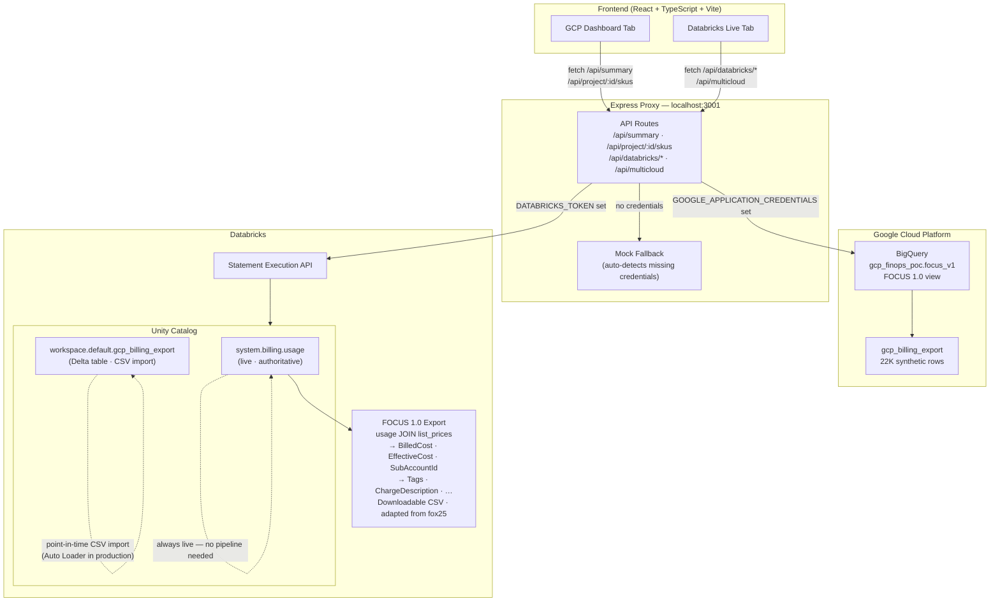
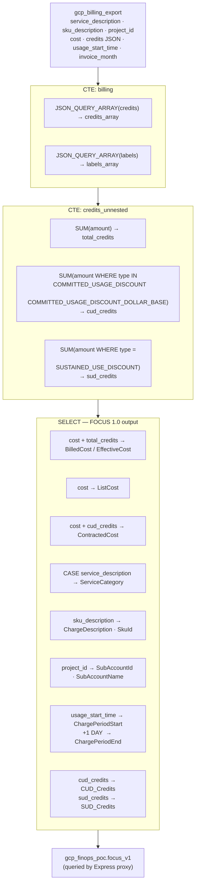
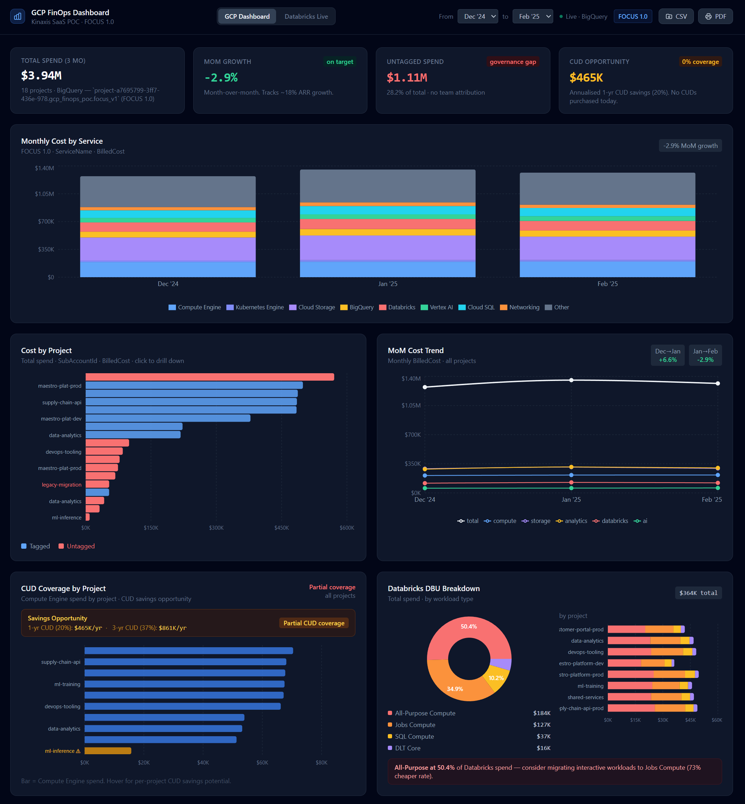
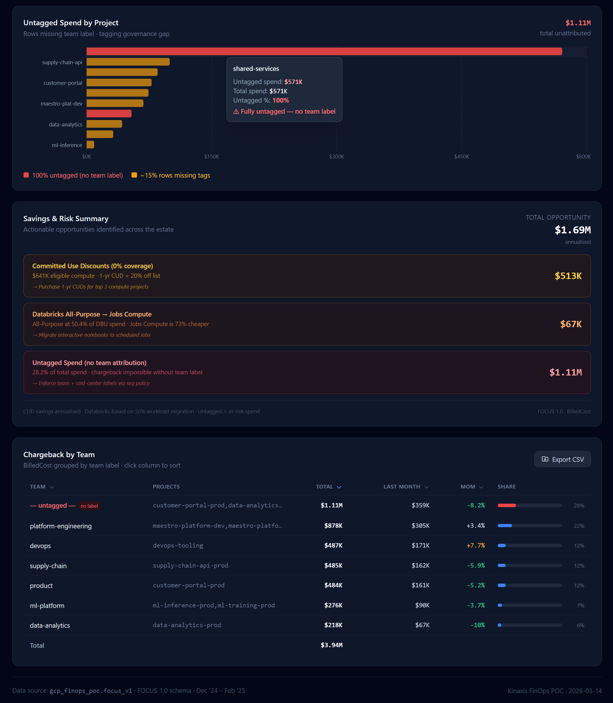
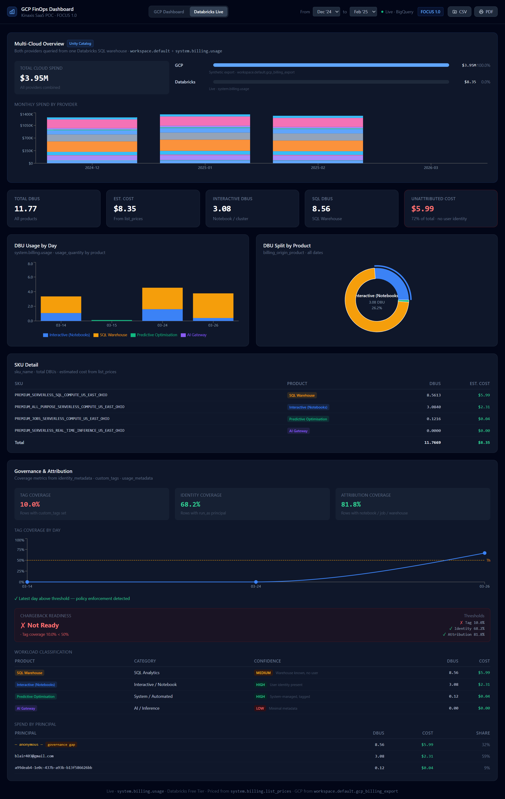

# Multi-Cloud FinOps Dashboard — GCP + Databricks

> Built as a take-home exercise for a FinOps role at Kinaxis.
> Turned into something more.

---

## Executive Summary

This repository demonstrates a working multi-cloud FinOps dashboard that:

- Normalizes GCP and Databricks billing data into the FinOps FOCUS 1.0 standard
- Surfaces governance signals such as tag coverage and attribution readiness
- Identifies optimization opportunities including CUD coverage gaps and workload cost inefficiencies
- Exports FOCUS-compliant cost data for downstream finance and reporting workflows

The system uses live Databricks `system.billing.usage` data and synthetic GCP billing data to illustrate production-ready architecture and FinOps operating patterns.

---

## Table of Contents

- [Executive Summary](#executive-summary)
- [The Story](#the-story)
- [What this is](#what-this-is)
- [Architecture](#architecture)
- [FOCUS 1.0 Transformation in BigQuery](#focus-10-transformation-in-bigquery)
- [Features](#features)
  - [GCP Dashboard tab](#gcp-dashboard-tab--live-bigquery)
  - [Databricks Live tab](#databricks-live-tab--real-system-tables)
- [Design decisions and trade-offs](#design-decisions-and-trade-offs)
- [Drawbacks and honest limitations](#drawbacks-and-honest-limitations)
- [What production looks like](#what-production-looks-like)
- [The finding](#the-finding)
- [Tech stack](#tech-stack)
- [Running it](#running-it)

---

## The Story

GCP had always been my thinnest cloud. I knew that.
So when Kinaxis reached out about a FinOps role, I decided to close that gap properly — not by reading documentation, but by building something real.

I started by standing up a GCP environment and loading synthetic billing data into BigQuery. From there, I implemented the FOCUS 1.0 specification from scratch, using Claude Code as a pair programmer. The process quickly surfaced real-world issues: BigQuery rejecting column names with dots, `JSON_EXTRACT_ARRAY` failing because of autodetected STRING types, and `InvoiceMonth` arriving as an integer (`202412`) instead of a proper date string (`2024-12`). Each problem was debugged directly in the system and resolved in place.

One of the first meaningful signals came from the Committed Use Discount (CUD) analysis. Coverage showed 0% across the dataset. That wasn't a bug — it was the finding. It immediately reframed the work from implementation to interpretation, which is where FinOps actually lives.

By the end of that first build session, the core GCP analytics stack was operational: ingestion, normalization, cost analysis, and a working dashboard layer. Every architectural decision remained deliberate. AI accelerated the implementation, but design direction and validation stayed human-driven.

At the same time, I provisioned a Databricks environment. Not because the project required it yet, but because the role clearly involved Databricks, and hands-on familiarity matters more than theory.

### Preparing for the Next Stage

After the initial interview, there was a window of time before the next round. I used that time deliberately.

I completed the FinOps Certified Practitioner exam with a score of 98%, and worked through *Cloud FinOps* by J.R. Storment and Mike Fuller to reinforce the operating model behind the tools. The goal wasn't just to build something functional — it was to ensure the architecture aligned with real FinOps practice.

That same week, I stumbled across a [FinOps X conference talk](https://www.youtube.com/watch?v=UW9KaPIqI2w) from a former WestJet colleague, Cory — who had built an open-source repository converting Databricks billing data into FOCUS format ([csyvenky-finops/fox25](https://github.com/csyvenky-finops/fox25)). Small world. We reconnected, attended the most recent FinOps Foundation quarterly update together, and he pulled me into the Canadian FinOps community meeting. That kind of network doesn't come from reading docs — it comes from showing up.

That preparation phase established a clear working rhythm: move quickly with modern tooling, stay disciplined about what ships.

### Extending the System into Databricks

The next step was connecting the dashboard to live Databricks usage data.

The first operational issue appeared immediately: the SQL warehouse cold-start behavior. Instead of blocking until ready, Databricks returned a `PENDING` state after the default timeout. A polling loop stabilized the workflow and ensured predictable responses.

With the connection stable, the focus shifted from visibility to governance. A governance panel was added to surface the signals that matter in real environments: tag coverage, identity coverage, attribution coverage, and spend by principal.

The initial tag coverage metric reported 10.5%, which didn't align with expectations. Investigation revealed the cause: `PREDICTIVE_OPTIMIZATION` workloads include a Databricks-managed system tag (`{"Predictive Optimization": "true"}`) unrelated to user governance. The calculation was corrected to measure coverage only across workloads users actually control — `INTERACTIVE` and `SQL` compute. Once adjusted, tag coverage dropped to 0.0%.

That result wasn't a failure. It was an honest baseline — exactly the kind of signal a FinOps team expects on day one.

To move from visibility to enforcement, a usage policy (`finops-governance-policy`) was implemented requiring four tags: `environment`, `team`, `cost-center`, `project`. A tag coverage trend chart tracks adoption over time. The system now shows both the current state and the path forward.

### The Architectural Insight

The GCP billing dataset was already available inside the Databricks workspace as a Delta table. That changed the framing of the problem entirely.

This wasn't about replacing BigQuery with Databricks. It was about using Databricks as the analytics layer across environments.

The Multi-Cloud Overview panel demonstrates that model directly. A single SQL warehouse queries both `workspace.default.gcp_billing_export` and `system.billing.usage` — one query engine, two providers, one governance model. That is the practical expression of the Unity Catalog value proposition.

---

## What this is

A production-quality multi-cloud FinOps dashboard. Live BigQuery backend for GCP. Live Databricks `system.billing.usage` for Databricks. FOCUS 1.0 compliant. Executive-ready exports. Multi-cloud overview powered by Databricks Unity Catalog.

---

## Architecture



> The Express proxy keeps all credentials server-side and provides the mock fallback. The Databricks Unity Catalog layer is what makes the Multi-Cloud Overview possible — one SQL warehouse querying both GCP and Databricks billing data.

---

## FOCUS 1.0 Transformation in BigQuery

GCP's native billing export uses vendor-specific column names and stores credits as a JSON array. The `focus_v1` view normalises this into FOCUS 1.0 in two CTEs before the final SELECT.



### Field mapping

| GCP Billing Export | FOCUS 1.0 Field | Transformation |
|---|---|---|
| `cost` | `ListCost` | Direct — list price before credits |
| `cost + total_credits` | `BilledCost`, `EffectiveCost` | Credits are negative amounts — addition applies them |
| `cost + cud_credits` | `ContractedCost` | CUD savings isolated from total credits |
| `credits[]` JSON array | `CUD_Credits`, `SUD_Credits` | Unnested and filtered by `type` field |
| `service_description` | `ServiceName` | Direct rename |
| `service_description` | `ServiceCategory` | `CASE` mapping to FOCUS taxonomy (Compute / Storage / Analytics / …) |
| `sku_description` | `ChargeDescription`, `SkuId` | Direct rename |
| `project_id` | `SubAccountId`, `SubAccountName` | GCP Projects map to FOCUS sub-accounts |
| `usage_start_time` | `ChargePeriodStart` / `ChargePeriodEnd` | End = Start + 1 day (GCP exports daily rows) |
| `location_region` | `RegionId`, `RegionName` | Direct rename |
| `project_labels` | `Tags` | Raw JSON preserved — parsed at query time |
| *(constant)* | `ProviderName`, `PublisherName` | `'Google Cloud'` — no source field |
| *(constant)* | `ChargeCategory`, `ChargeFrequency` | `'Usage'` / `'Usage-Based'` |

---








---

## Features

### GCP Dashboard tab — live BigQuery

- **Express proxy** → BigQuery `gcp_finops_poc.focus_v1` on every load
- **FOCUS 1.0 compliance** — `BilledCost`, `ServiceCategory`, `SubAccountId`, `ChargePeriodStart`
- **Date range picker** — slice any window, all charts update live
- **Mock fallback** — runs fully offline without credentials

| Panel | What it shows |
|---|---|
| **KPI row** | Total spend, MoM growth, untagged spend, CUD opportunity |
| **Monthly Cost by Service** | Stacked bar, 9 services, MoM badge |
| **Cost by Project** | Tagged vs untagged, click to drill down to SKU level |
| **MoM Trend** | Total + 5 service categories |
| **CUD Coverage** | Compute Engine spend by project · 1-yr and 3-yr CUD savings opportunity |
| **Databricks DBU Breakdown** | Donut by workload type, bar by project |
| **Untagged Spend** | Surfaced and colour-coded by severity |
| **Savings Summary** | Executive one-pager: CUD gap + Databricks waste + tagging risk |
| **Chargeback by Team** | Live from tag data, MoM%, CSV export |
| **Anomaly Banner** | Flags month-over-month spend spikes automatically |

### Databricks Live tab — real system tables

Live data pulled directly from `system.billing.usage` via the Databricks Statement Execution API. Includes a **FOCUS 1.0 export** — a SQL transformation over `system.billing.usage` + `system.billing.list_prices` that produces all standard FOCUS cost fields as a downloadable CSV, adapted from [csyvenky-finops/fox25](https://github.com/csyvenky-finops/fox25).

| Panel | What it shows |
|---|---|
| **KPI row** | Total DBUs, est. cost, interactive vs SQL split, unattributed cost |
| **DBU Usage by Day** | Stacked bar by product (INTERACTIVE, SQL, PREDICTIVE_OPTIMIZATION, AI_GATEWAY) |
| **DBU Split by Product** | Active-shape donut |
| **SKU Detail** | Full SKU breakdown with DBUs and list-price cost |
| **Governance & Attribution** | Tag coverage, identity coverage, attribution coverage |
| **Tag Coverage Trend** | Line chart by day with 50% policy threshold line |
| **Chargeback Readiness** | Pass/fail against tag + identity + attribution thresholds |
| **Workload Classification** | HIGH/MEDIUM/LOW confidence per product type |
| **Spend by Principal** | Anonymous SQL spend flagged as governance gap |
| **Multi-Cloud Overview** | GCP + Databricks spend from one SQL warehouse |
| **FOCUS 1.0 Export** | Download Databricks billing as a FOCUS-compliant CSV (adapted from fox25) |

---

## Design decisions and trade-offs

### Dual-source architecture: BigQuery + Databricks

**Decision:** GCP billing data lives in BigQuery. Databricks billing data is queried from `system.billing.usage`. Two separate backends, unified by the Express proxy.

**Why:** Each source is the authoritative home for its own data. GCP's billing export pipeline writes to BigQuery natively — it's the right place to query it. `system.billing.usage` is only accessible from within Databricks. Forcing one through the other would add unnecessary complexity and ingestion lag.

**Trade-off:** Two query engines to maintain. In a team environment you'd want a single entrypoint — see "What production looks like" below.

---

### GCP data is synthetic

**Decision:** The GCP billing data is generated — 22,115 synthetic rows across 10 projects, loaded into BigQuery.

**Why:** Setting up a real GCP org billing export takes days (billing accounts, org policy, export pipeline). The goal was to demonstrate FOCUS 1.0 analysis patterns and production-quality tooling, not to wait for a real bill.

**Drawback:** The GCP numbers ($3.95M total spend) are illustrative. The schema, the SQL, the FOCUS mapping, and the findings (0% CUD coverage, $1.11M untagged) are all real and correct — just applied to synthetic input.

**What live data looks like:** Enable billing export in your GCP org → BigQuery table appears within 24 hours → point `BQ_DATASET` at it → dashboard shows real numbers. The code doesn't change.

---

### Databricks data is real

**Decision:** The Databricks tab pulls live from `system.billing.usage` with no caching or mocking.

**Why:** I have a real Databricks free-tier account. The system tables are there, the Statement Execution API works, and showing live data is more honest than synthetic data. Tag coverage is 0.0% — not because I made it up, but because that's the actual state before the governance policy was applied.

**Trade-off:** Cold warehouse starts add 30–45 seconds to the first load. The server polls the Statement Execution API until the query completes. On a pre-warmed warehouse (production) this drops to 2–3 seconds.

---

### Multi-Cloud Overview: Unity Catalog as the analytics layer

**Decision:** The Multi-Cloud Overview panel queries both `workspace.default.gcp_billing_export` (the GCP data, imported as a Delta table) and `system.billing.usage` from the same Databricks SQL warehouse. Both datasets, one query engine.

**Why:** This is the Unity Catalog value proposition. You can federate external data (GCP billing export, AWS CUR, on-prem cost files) into Databricks and govern everything from one place — one access control model, one lineage graph, one query surface.

**Drawback:** The GCP data in Databricks is a point-in-time CSV import, not a live pipeline. It goes stale the moment it's imported. This is fine for a demo; it's not a production design.

**What production looks like:** GCP Billing Export → GCS bucket → Databricks Auto Loader → Delta table (incremental, streaming). The dashboard code doesn't change — just the data stays fresh automatically.

---

### Express proxy over direct frontend queries

**Decision:** All data fetches go through an Express server (`localhost:3001`). The frontend never touches BigQuery or Databricks directly.

**Why:** Keeps credentials server-side. Allows fallback logic (BigQuery error → serve mock data). Gives a clean API contract between frontend and backend that survives data source changes.

**Trade-off:** Extra hop. In a serverless deployment (Cloud Run, Lambda) this is the right pattern anyway. For a static site it would need a rethink.

---

## Drawbacks and honest limitations

| Limitation | Impact | Fix in production |
|---|---|---|
| GCP data is synthetic | Numbers aren't real | Real billing export → BigQuery pipeline |
| GCP data in Databricks is a CSV import | Goes stale immediately | Auto Loader + GCS export schedule |
| Databricks cold-start latency | 30–45s first load | Pre-warmed warehouse or serverless SQL |
| No auth layer | Anyone with localhost access sees everything | OAuth + row-level security in Unity Catalog |
| Tag coverage 0% | Can't do chargeback today | Apply org-level usage policy + enforce tags |
| Single-region | No multi-region cost comparison | Extend FOCUS view with `Region` field |
| No alerting | Anomalies are visible but silent | Connect to PagerDuty / Slack via Cloud Functions |

---

## What production looks like

```
GCP Billing Export
    → Cloud Storage bucket (daily)
    → Databricks Auto Loader → Delta table (streaming ingest)
    → Unity Catalog: gcp_billing.focus_v1

Databricks system.billing.usage
    → Already in Unity Catalog, no pipeline needed

Azure (future) — via FinOps Hub (FOCUS 1.2)
    → Azure Data Lake Storage Gen2 export
    → Databricks Auto Loader → Delta table
    → Unity Catalog: azure_billing.focus_v2

Dashboard
    → Databricks SQL warehouse (single endpoint)
    → Governs all three via Unity Catalog policies
    → Tag enforcement via workspace policies (already built)
    → Chargeback reports auto-exported to finance team monthly
```

One warehouse. One governance model. Three clouds.

---

## The finding

**GCP:** 0% CUD coverage across $641K of eligible quarterly compute spend. At 1-yr CUD rates (20% discount): **$513K/year**. At 3-yr rates (37%): **$948K/year**.

**Databricks:** 50.4% of DBU spend on All-Purpose Compute — the most expensive tier. Jobs Compute runs the same pipelines at 73% lower cost. Another **$67K/year** with a scheduler change.

**Governance:** 0% tag coverage on Databricks SQL workloads. $3.64 of $5.69 total Databricks spend is anonymous — no user identity, no team attribution, no chargeback possible.

**Total opportunity surfaced: $1.69M annualised.**

---

## Tech stack

```
dashboard/          React 18 + TypeScript + Vite + Tailwind + Recharts
server/             Express + @google-cloud/bigquery + Databricks Statement Execution API
focus_v1_view.sql   BigQuery FOCUS 1.0 view over gcp_billing_export
```

---

## Running it

### Prerequisites
- Node.js 18+
- A GCP project with BigQuery enabled (optional — mock data works without it)
- A Databricks workspace with system tables enabled (optional)

### Setup

```bash
npm run install:all

cp server/.env.example server/.env
# Fill in: GOOGLE_APPLICATION_CREDENTIALS, BQ_PROJECT_ID
# Optionally: DATABRICKS_HOST, DATABRICKS_TOKEN, DATABRICKS_WAREHOUSE_ID

npm run dev
```

**Without BigQuery credentials** — the server auto-detects and serves mock data. The GCP dashboard runs fully offline.

**Without Databricks credentials** — the Databricks Live tab returns 503. Everything else works.

---

*Built with [Claude Code](https://claude.ai/claude-code) as AI pair programmer · FOCUS 1.0 · GCP BigQuery · Databricks Unity Catalog · React · TypeScript*
